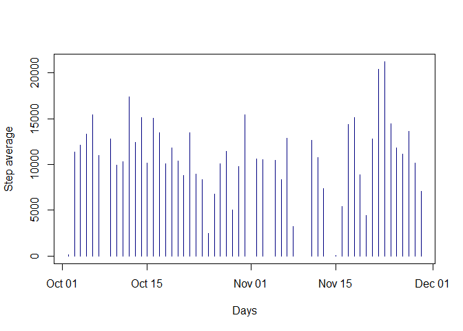
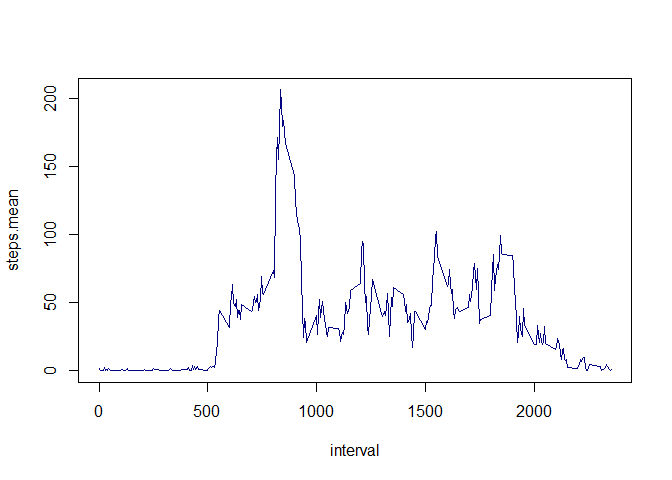
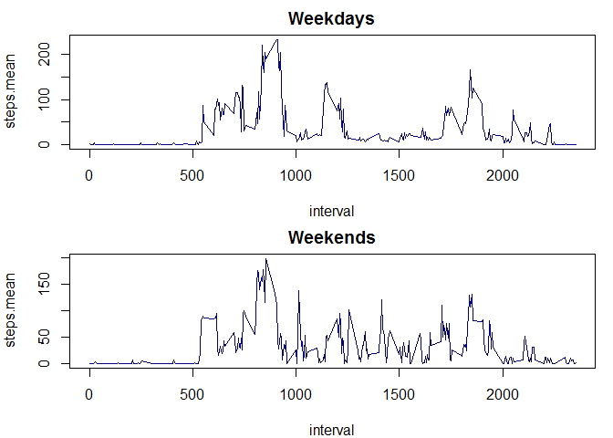

Reproducible Research: Peer Assessment 1
================
Pathik Chamaria
January 26, 2017

Loading and preprocessing the data
----------------------------------

``` r
act <-
    read.csv("activity.csv", colClasses = c("integer", "Date", "integer"))
```

What is mean total number of steps taken per day?
-------------------------------------------------

Let's first plot the average steps per day in a histogram

``` r
p1 <- aggregate(steps ~ date, act, sum, na.rm = TRUE)
par(mfrow = c(1, 1))
with(p1, plot(date, steps, type = "h", xlab = "Days", ylab = "Step average", col = "navy"))
```



Graph 1. Average steps per day

And then calculate mean and median per day

``` r
tmp.mean <- mean(p1$steps, na.rm = TRUE)
tmp.median <- median(p1$steps, na.rm = TRUE)
```

Daily average step counting is `{r} tmp.mean` and the median is `{r} tmp.median`

What is the average daily activity pattern?
-------------------------------------------

Let's plot a time-series between average steps from the entire dataset and the period of the day.

``` r
p2 <- aggregate(steps ~ interval, act, mean, na.rm = TRUE)
names(p2) <- c("interval", "steps.mean")
par(mfrow = c(1, 1))
with(p2, plot(interval, steps.mean, type = "l", col = "navy"))
```



Graph 2. Average step counting per daily period

From this plot it is possible to notice some activity early in the morning from 5am, a peak around 8:30am and some variation until 7pm, when the activity finally disminishes as a pattern.

``` r
# Get peak coordinates
max.steps.y <- max(p2$steps.mean)
max.steps.x <- p2$interval[which(p2$steps.mean == max.steps.y)]
peak.int <- paste(as.character(max.steps.x %/% 100), ":", as.character(max.steps.x %% 100))
```

The peak is noticed at `{r} peak.int` with an average of `{r} max.steps.y` steps.

Imputing missing values
-----------------------

``` r
# Get number of missing entries
missing <- sum(is.na(act$steps))
miss.pct <- round(sum(is.na(act$steps)) / length(act$steps), 2) * 100
```

There is a total of `{r} missing` missing entries, which represents `{r} miss.pct`% of the total observations. As this may lead to biased calculations, let's impute some values in the missing step count. We will use daily period step average to fill those gaps.

``` r
# Impute implementation for missing step values
# Merge original dataset with the average step per period of the day - these will be the default values for the gaps
act2 <- merge(act, p2, by = "interval", sort = FALSE)
# Order the temporary dataset by date (merge by interval unsorted the dataset, which could cause problems in the replacements)
act2 <- act2[order(act2$date), ]
# Creates a list of the nee steps column in te final dataset, keeping the existing values and replacing the missing ones by its corresponding period's step average
steps.new <-
replace(act2$steps, which(is.na(act2$steps)), act2$steps.mean[which(is.na(act2$steps))])
# Creates the new final dataset without the step.mean column
act.new <- act2[, 1:3]
# Replaces steps column with the replacement list
act.new$steps <- steps.new
# Plots a new histogram with the gaps filled
p3 <- aggregate(steps ~ date, act.new, sum)
par(mfrow = c(1, 1))
with(p3, plot(date, steps, type = "h", xlab = "Days", ylab = "Step average", col = "navy"))
```


Graph 3. Average steps per day with the missing step counting replaced by daily period average

Comparing with the first graph, it is possible to notice less blank spaces between the hist bars, and the outliers become more visible (step counting in Oct 2nd and Nov 15th).

And then calculate mean and median per day

``` r
tmp.mean2 <- mean(p3$steps, na.rm = TRUE)
tmp.median2 <- median(p3$steps, na.rm = TRUE)
```

Daily average step counting is `{r} tmp.mean2` and the median is `{r} tmp.median2`

Imputing the missing values did not change the average, but made the median to be equal to mean.

Are there differences in activity patterns between weekdays and weekends?
-------------------------------------------------------------------------

To answer this question, we will plot 2 time series like in the Graph 2, but splitting the data by weekday/weekend factor.

``` r
# Create a new variable in the dataset to store a factor variable that determines either the observation was taken in a weekday or weekend
act.new$wday <- as.POSIXlt(act.new$date)$wday
# Convention: wknd flag variable receives 1 for weekdays and 2 for weekends
wday.new <- ifelse(act.new$wday < 6, 1, 2)
act.new$wknd <- as.factor(wday.new)
```

``` r
par(mfrow = c(2, 1), mar = c(4,4,2,1))

# Weekdays
p4.1 <- aggregate(steps ~ interval, subset(act.new, act.new$wday == 1), mean, na.rm = TRUE)
names(p4.1) <- c("interval", "steps.mean")
with(p4.1, plot(interval, steps.mean, type = "l", col = "navy"))
title(main = "Weekdays")

p4.2 <- aggregate(steps ~ interval, subset(act.new, act.new$wday == 2), mean, na.rm = TRUE)
names(p4.2) <- c("interval", "steps.mean")
with(p4.2, plot(interval, steps.mean, type = "l", col = "navy"))
title(main = "Weekends")
```



Graph 4. Activity patterns in weekdays and weekends

According to the graph patterns whereas in weekdays there are specific periods of more intense activity, on weekends there are more peaks during the day. Here we list some findings:

Weekdays

-   intense activity in the early, but few steps - short distances
-   commute around 8am and 6-7pm
-   lunch around noon
-   some minor peaks after 8pm, again short distances

Weekends

-   a period of constant activity in the early morning, probably a walk or jogging
-   a similar "commuting" behavior that could lead to determine that this person works on Saturdays
-   several intermediate peaks denote non-routine activities during weekends -some (little) activity during 0 to 5am not noticed in the Graph 2.
